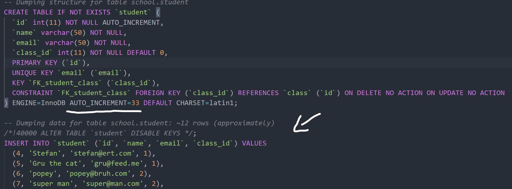

# PHP CRUD

As the name implies, it was an exercise during my [BeCode](https://becode.org/) training in which we had to do CRUD operations in PHP OOP using MVC (wow, so many acronyms)

## Exercise type and duration

Initially we had 3️⃣ days to complete it (06/12/2021 - 09/12/2021) but was extended by one because many of us had to do something else for an entire day.

## Collaborators

- [Naama Kaplan](https://github.com/N-Kaplan)
- [Binayak Shrestha](https://github.com/itsme17)
- [Stefan Amuraritei](https://github.com/StefanAmur)

## Learning objectives

- ✔To be able to connect to a database
- ✔To be able to write a simple Create, Read, Update & Delete (CRUD) application
- ✔Use a provided MVC structure to work into.

## How to use it?

Since it's an PHP project you're going to need to have installed PHP, Apache and MySql. And since there was no db given to us I made one in the most basic form. If you want to use it, see the file `phpSchoolDb.sql`.  
This file will generate the database as we had it at the end of our project, that means it already contains some rows.
If you want to start fresh just delete the `INSERT` statements and set `AUTO_INCREMENT=1`. Do that for all 3️⃣ tables. See the image below.  
PS: The db has some easter eggs regarding our coaches [Tim](https://github.com/Timmeahj) and [Sicco](https://github.com/Sick-0). If you find it (it isn't that hard), the beer is on me.

## Day 1️⃣. How did it go?

First day started with making sure that everyone had a working local Apache server and MySql db connection.  
Then we decided on who makes what and we settled on the following:

- [Naama](https://github.com/N-Kaplan) \- everything related to the `Teacher` class;
- [Binayak](https://github.com/itsme17) \- everything related to the uhm.... `Classes` class;
  > we chose `Classes` because I wasn't sure if `Class` name is reserved in PHP. Please let me know if you know exactly  
  > in hindsight, maybe we should have named this class the `Classroom` ...class
- Me \- everything related to the `Student` class;

Planning done, work started and by the end of day 1️⃣ we had the following:

- proper working environments
- MVC model
- `DataSource`, `DotEnv`, `Student`, `Teacher` classes;
- `StudentLoader`, `TeacherLoader`
- `StudentController`

> all these classes were just the beginning and they went thruough some alterations during the entire project

## Day 2️⃣. How did it go?

Issue: how to use only one controller for multiple views?

> No solution yet; currently there's a separate controller for every view.

## Day 3️⃣. How did it go?

To be continued...

## The Mission

You will create a CRUD system to store student, teacher and class information in the database.
You do not need to provide any login for this script, everybody can change and view anything!

You will use the MVC structure provided in the [PHP MVC Boilerplate](https://github.com/becodeorg/php-mvc-boilerplate) repo provided by your coach, to help you on your way!

In this assigment you will end up with at least 3 models and 3 controllers, but you could end up with more. Model the software how you want it!

## Tips

- You will see that the Teacher and Student entity are really similar - maybe you can use `Extend` here as an OOP technique?
- Create and Update are very similar in how they behave, with some smart coding techniques you could use almost the same code for both pages.

## Must-have features

You have to provide the following pages for Students, Teacher & Class.

- ✔A general overview of all records of that entity in a table
  - ✔Each row should have a button to edit or delete the entity
  - ✔This page should have a "create new" button
- ✔A detailed overview of the selected entity
  - ✔This should include a button to delete this entity
  - 🤔Edge case: A teacher cannot be removed if he is still assigned to a class
  - 🤔Edge case: If you remove a class, make sure to remove the link between the students and the class.
- ✔A page to edit an existing entity
- ✔A page to create a new entity

### Fields

On the general overview table you can yourself decide what would be useful information to show.

On the detailed overview you have to provide the following information:

#### Student

- ✔Name
- ✔Email
- ✔Class (with clickable link)
- ✔Assigned teacher (clickable link - relation via class)

#### Teacher

- ✔Name
- ✔Email
- ✔List of all students currently assigned to him (clickable link)

#### Class

- ✔Name class (Giertz, Lamarr, ...)
- ✔Location (Antwerp, Gent, Genk, Brussels, Liege)
- 🤔Assigned teacher (clickable link)
- ✔List of assigned students (clickable link)

## Nice to have features

- ❌Add a search bar at the top of each page to search for the names of teachers or students
- ❌Make an address entity. An address can be assigned to a student or teacher (where he lives) or to a class (where are the lessons given).
- ❌Add [Basic HTTP Authentication](https://www.lifewire.com/password-protect-single-file-with-htaccess-3467922) with a `.htaccess` file.
